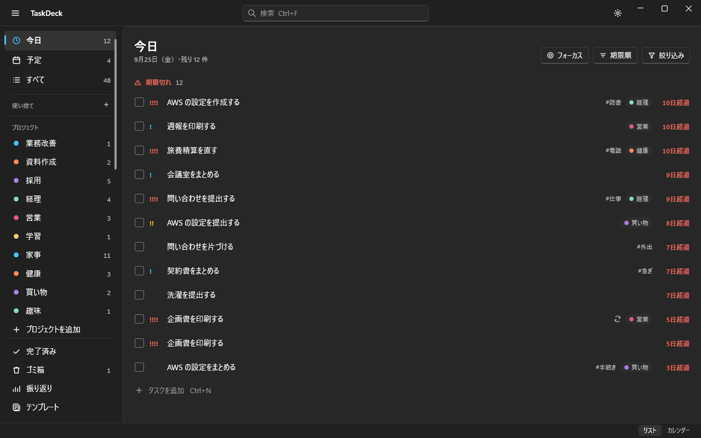

# TaskDeck

思いついた瞬間に、どのアプリを使っていても1行で書き留められる、Windows 常駐の Todo アプリです。
`Ctrl+Shift+Space` で入力欄を呼び出し、「ゴミを出す 明日」のように書くだけで、期限・優先度・タグ付きのタスクになります。



- 動作環境: Windows 10 / 11（x64）。配布版は .NET を同梱した exe 1本で、別途インストールは要りません
- データはすべて手元の PC に保存します（アカウント登録なし・同期なし）
- ダウンロード: [Releases](https://github.com/takosasi-dev/taskdeck/releases) の `TaskDeck.exe`。置いた場所から起動するだけです（コード署名はしていないので、初回は SmartScreen の「詳細情報」→「実行」）
- 開発の状況: プレリリースの段階です（実機での確認を続けています）

## 使い方の流れ

1. **書く** — どこからでも `Ctrl+Shift+Space`。クイック入力に1行書いて Enter（Esc で閉じる）
2. **見る** — `Ctrl+Shift+T` でメイン画面。「今日」「予定」「すべて」、プロジェクト・タグ・保存した絞り込みで切り替え
3. **片づける** — 選んで `Space` で完了。`Ctrl+Z` で取り消し
4. **忘れない** — リマインドの時刻に Windows の通知（「完了にする」「30分後に再通知」）。朝に今日のまとめ
5. **振り返る** — 振り返りの画面で完了数・期限内率・曜日ごとの傾向。Markdown に書き出せる

× で閉じてもタスクトレイに残ります。終了はトレイのアイコンを右クリック →「終了」。

### クイック入力の書き方

| 書き方 | 例 | 意味 |
|---|---|---|
| 日付 | `明日` `金曜` `来週月曜` `9/30` `9月30日` | 期限の日付（いちばん後ろの表現を使う） |
| 時刻 | `15時` `15:30` | 期限の時刻（日付が無ければ今日。過ぎていれば明日） |
| 優先度 | `!1`〜`!4`、`!!!` | 低〜緊急（`!` の数でもよい） |
| プロジェクト | `@仕事` | 最後に書いたものを使う |
| タグ | `#買い物` | いくつでも |
| 繰り返し | `*毎日` `*平日` `*毎週月水金` `*隔週火` `*毎月末` | 繰り返しのタスクにする |

例: `企画書を出す 金曜 17時 @仕事 #提出 !3`。読み取れなかった部分はタイトルに残るので、入力が消えることはありません。記号をそのまま書きたいときは `\#` のように `\` を前に付けます。

## 主な機能

- タスク: サブタスク（親を含めて3段まで）、ドラッグで並べ替え・親子の付け替え、複数選択と一括操作、繰り返し、リマインド、メモ（URL のタイトル表示は既定で OFF）
- 整理: プロジェクト・タグ・複合の絞り込みと保存、検索、コマンドパレット（`Ctrl+K`、あいまい一致・読みでも当たる）
- 表示: 今日・予定・すべて・完了済み・ゴミ箱、カレンダー（月・週。祝日と天気）、振り返り、フォーカスモード（`Ctrl+Shift+F`、今やる1件だけ）
- テンプレート: よく使う手順をまとめて展開（「週次レビュー」など）。パレットで `+テンプレート名`
- 使い捨てリスト: 買い物メモなど、終わったら捨てるチェックリスト。タスクとは別物で、一覧・検索・振り返り・通知には出ない。メイン画面の中と、常に手前の小窓を行き来できる。テンプレートとの行き来もできる
- 入出力: JSON（丸ごと・置き換え／追加の読み込み）、CSV、Markdown
- 見た目: ライト・ダーク・システムに合わせる、アクセント色、行の詰め方、動きを減らす

## ショートカット

どのアプリからでも（設定の「ショートカット」で変えられます）:

| キー | 動き |
|---|---|
| `Ctrl+Shift+Space` | クイック入力 |
| `Ctrl+Shift+T` | メイン画面を出す |
| `Ctrl+Shift+F` | フォーカスモード |

メイン画面で（全部の一覧は `?` で出ます）:

| キー | 動き |
|---|---|
| `Ctrl+N` | 新しいタスク |
| `Space` | 完了にする／戻す |
| `Delete` | ゴミ箱に入れる |
| `Ctrl+D` | 複製する |
| `F2` / `Enter` | 名前を書き換える |
| `Ctrl+Z` | 取り消す |
| `Tab` / `Shift+Tab` | サブタスクにする／戻す |
| `Ctrl+↑` / `Ctrl+↓` | 並び順を動かす |
| `Ctrl+K` | コマンドパレット |
| `Ctrl+F` | 検索 |
| `Ctrl+1`〜`6` | ビューの切り替え（今日・予定・すべて・完了済み・カレンダー・振り返り） |
| `Ctrl+B` / `Ctrl+I` | サイドバー／詳細ペインを隠す・出す |
| `Ctrl+T` | テンプレートから作る |
| `Ctrl+,` | 設定 |
| `Esc` | 戻る（検索を消す → 詳細を閉じる → しまう） |

## データの保存先

`%LOCALAPPDATA%\TaskDeck\` に置きます。

| もの | 場所 |
|---|---|
| タスクなどのデータ（SQLite） | `taskdeck.db` |
| 設定 | `settings.json` |
| 起動時のバックアップ（5世代） | `backups\` |
| ログ（7日分。タスクの題名・メモは書きません） | `logs\` |

JSON の書き出し（設定の「データ」）で丸ごと持ち出せます。

## Windows に登録するもの

| もの | 場所 | 止め方 |
|---|---|---|
| ログオン時の自動起動（既定でオン） | `HKCU\Software\Microsoft\Windows\CurrentVersion\Run` | 設定の「全般」でオフにすると消えます |
| グローバルホットキー（3つ） | 起動中だけ | 他のアプリとぶつかったら設定の「ショートカット」で変える |
| 通知のための登録（AUMID・COM） | `HKCU\Software\Classes` の下 | — |

### アンインストール

1. 設定の「全般」で自動起動をオフにする
2. トレイのアイコン →「終了」
3. exe と `%LOCALAPPDATA%\TaskDeck\` を消す

## 外部との通信

登録不要・無料・API キー不要のものだけを使い、**タスクの内容は送りません**。設定の「外部サービス」でまとめて止められます（オフラインモード）。

| 使い道 | 相手 | 送るもの |
|---|---|---|
| 祝日 | 内閣府「国民の祝日」CSV | なし（1日1回まで取りに行く） |
| 天気（カレンダー） | Open-Meteo | 小数第2位に丸めた緯度・経度（場所を設定したときだけ） |
| メモの URL のタイトル | Microlink | URL（既定でオフ。オンにしたときだけ） |
| 更新の確認 | GitHub Releases | なし（正式版の最新を1日1回見に行き、設定の「TaskDeck について」に出すだけ。取れなかったときは1時間ごとにやり直す。プレリリースは知らせない） |

## ビルド

.NET 10 SDK が要ります。

```powershell
dotnet build TaskDeck.slnx
dotnet test TaskDeck.slnx

# 開発用のデータフォルダで起動（本番の %LOCALAPPDATA%\TaskDeck・自動起動・ホットキーに触れない）
$env:TASKDECK_DATA_DIR = "$PWD\.devdata\mine"; dotnet run --project src/TaskDeck.App

# 配布用の exe 1本を dist\ に作る
dotnet publish src/TaskDeck.App -c Release -r win-x64 --self-contained -p:PublishSingleFile=true -p:IncludeNativeLibrariesForSelfExtract=true -p:DebugType=none -o dist
```

開発用フォルダ（`TASKDECK_DATA_DIR`）では、自動起動を登録せず、ホットキーは `TASKDECK_DEV_HOTKEYS=1`、Windows の通知は `TASKDECK_DEV_TOASTS=1` のときだけ使います。その他の確認用の入口は `docs/INTERFACES.md` の 5.8〜5.10 にあります。

## 性能（1万件のデータ、2026-09-25 に計測）

| 項目 | 目標（NFR） | 実測 |
|---|---|---|
| 起動（プロセス開始 → メイン画面の最初の描画） | 2.0 秒 | 1.4 秒（配布版。2回目以降の起動の中央値。起動画面は約 0.4 秒で出る）。exe を圧縮した発行では 1.9 秒 |

起動画面は専用のスレッドで描き、その間に DB の準備（スレッドプール）とメイン画面の組み立て（UI スレッド）を並べます（内訳はログの「起動の内訳」に毎回出ます）。
DB は EF のコンパイル済みモデルを使い、最初のクエリの組み立てはメモリ上の空の DB で先に温めます。詳細ペイン・カレンダー・振り返りは初めて出すときに作り、
トレイ・通知・ホットキーの登録と、DB の更新が無い起動のバックアップは画面を出してから行います。
配布版は ReadyToRun・圧縮なしの単一 exe（約 285MB）です。圧縮する発行（`-p:EnableCompressionInSingleFile=true`）は約 110MB になりますが、起動のたびに展開するぶん 0.5 秒ほど遅くなります（2つを交互に起動して測った値。PC が混んでいる時間帯は、どちらも 0.3〜0.4 秒遅くなります）。

## 設計の資料

- `CLAUDE.md` — コードの決まり（時刻・例外・IME・外部 API）
- `docs/INTERFACES.md` — 部品どうしの約束（どこに何があり、どう使うか）
- `docs/mockups/*.dc.html` — 画面のモックアップ

技術: C# 14 / .NET 10 / WPF、WPF-UI、CommunityToolkit.Mvvm、EF Core（SQLite）、Ical.Net（繰り返し）、Serilog、Hardcodet.NotifyIcon.Wpf、CommunityToolkit.WinUI.Notifications。テストは xUnit と NSubstitute。

## ライセンス

MIT License（[LICENSE](LICENSE)）。変更点は [CHANGELOG.md](CHANGELOG.md) にあります。
